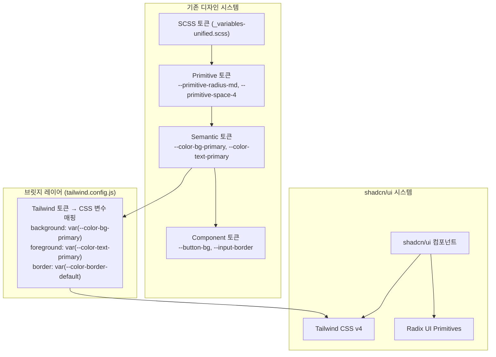

# shadcn/ui 마이그레이션 전략 문서

> 최종 수정: 2026-02-20  
> 작성 기준: Preact + Vite + Tailwind v4 + 기존 SCSS 3계층 토큰 시스템

---

## 1. 현황 분석

### 두 스타일 시스템 공존 구조



### 현재 적용 완료된 shadcn/ui 컴포넌트

| shadcn 컴포넌트 | 사용처 |
|---|---|
| `badge` | `Autocomplete` (다중선택 칩) |
| `button` | (도입됨, 아직 기존 Button과 병행) |
| `command` | `Autocomplete` (검색 목록) |
| `dialog` | (도입됨, 아직 기존 Dialog와 병행) |
| `popover` | `Autocomplete` (드롭다운 레이어) |

---

## 2. CSS 우선순위(Layering) 전략

### 핵심 결정: **기존 SCSS 디자인 토큰을 진실의 원천(Source of Truth)으로 유지**

shadcn/ui 스타일은 CSS 변수를 통해 기존 토큰을 참조하게 하며, Tailwind는 그 브릿지 역할만 수행한다.

```
기존 SCSS 변수 → tailwind.config.js 브릿지 → shadcn/ui 컴포넌트 스타일
```

### @layer 우선순위 정의

`index.css`에 명시적 레이어 순서를 선언하여 CSS 캐스케이드를 제어한다.

```css
/* index.css 상단에 추가 */
@import "tailwindcss";

/* 레이어 우선순위 선언 (낮은 순위 → 높은 순위) */
@layer reset, base, tokens, shadcn, components, utilities;
```

| @layer | 내용 | 우선순위 |
|---|---|---|
| `reset` | Tailwind preflight | 최하위 |
| `base` | `index.css` 전역 기본 스타일 | ↓ |
| `tokens` | `_variables-unified.scss` CSS 변수 선언 | ↓ |
| `shadcn` | `components/ui/*.tsx` 내 Tailwind 클래스 | ↓ |
| `components` | `ui-components/**/*.scss` 커스텀 컴포넌트 | ↓ |
| `utilities` | 인라인 유틸리티 클래스 (`!important` 없이) | 최상위 |

### `important` 옵션 사용 여부: **비권장**

```js
// tailwind.config.js — important: true 는 사용하지 않는다
// 이유: SCSS 컴포넌트 스타일까지 모두 덮어써서 디버깅이 불가능해짐
export default {
  // important: true,  ← 금지
  darkMode: ["selector", '[data-theme="dark"]'],
  // ...
}
```

**예외**: 특정 유틸리티 클래스에만 필요한 경우 개별 클래스에 `!` 접두사를 붙인다.
```tsx
// 전체 important 대신 개별 클래스에 ! 사용
<div className="!z-[10000]">...</div>
```

### Tailwind Preflight vs 기존 SCSS reset 충돌 방지

`index.css`의 `* { margin: 0; padding: 0; box-sizing: border-box; }` 리셋이 Tailwind preflight과 중복된다.
Tailwind v4에서는 `@import "tailwindcss"` 시 preflight이 자동 포함되므로, 기존 리셋은 제거하고 Tailwind preflight을 단일 소스로 삼는다.

```css
/* 기존 중복 리셋 — 제거 대상 */
/* * { margin: 0; padding: 0; box-sizing: border-box; } */
```

---

## 3. Preact 호환성 가이드

### 3.1 `preact/compat` 설정 확인 포인트

`vite.config.ts`에 이미 alias가 설정되어 있다.

```ts
// vite.config.ts (현재 설정 — 변경 불필요)
resolve: {
  alias: {
    'react': 'preact/compat',
    'react-dom': 'preact/compat',
    'react-dom/test-utils': 'preact/compat',
    'react/jsx-runtime': 'preact/jsx-runtime',
  },
},
```

### 3.2 Radix UI 프리미티브 호환성 체크포인트

Radix UI는 내부적으로 `React.forwardRef`, `React.createContext`, `React.useId`를 사용한다.
`preact/compat`의 버전별 지원 여부를 확인한다.

| Radix 사용 패턴 | Preact/compat 지원 여부 | 검증 방법 |
|---|---|---|
| `React.forwardRef` | ✅ 지원 | `import { forwardRef } from 'preact/compat'` |
| `React.createContext` | ✅ 지원 | 기존 `ThemeProvider` 동작 확인 |
| `React.useId` | ✅ Preact ≥ 10.11 | `package.json`의 `preact` 버전 확인 |
| `Radix Slot (asChild)` | ⚠️ 주의 | 아래 항목 참고 |
| `createPortal` | ✅ 지원 | `import { createPortal } from 'preact/compat'` |
| `React.Children` API | ⚠️ 부분 지원 | Radix 내부 동작이 의존하는 경우 주의 |

### 3.3 `asChild` (Radix Slot) 패턴 주의사항

Radix의 `asChild` 프로퍼티는 `@radix-ui/react-slot`의 `Slot` 컴포넌트를 사용한다.
Preact에서 `cloneElement` 동작이 미묘하게 다를 수 있다.

**검증 방법:**
```tsx
// 이 패턴이 정상 동작하는지 반드시 테스트
<PopoverAnchor asChild>
  <div>트리거</div>  {/* ref가 제대로 전달되는지 확인 */}
</PopoverAnchor>
```

**이미 검증된 패턴 (Autocomplete에서 동작 확인됨):**
```tsx
<PopoverAnchor asChild>  {/* ✅ 동작 확인 */}
  <div className="flex ...">
    <input ref={inputRef} />
  </div>
</PopoverAnchor>
```

### 3.4 새 shadcn 컴포넌트 추가 시 필수 체크리스트

```bash
# shadcn CLI로 컴포넌트 추가
npx shadcn@latest add [component-name]
```

추가 후 반드시 확인:
- [ ] 생성된 파일에서 `import React from 'react'` → 기존 alias로 해결되는지 확인
- [ ] `lucide-react` import → `lucide-preact`로 교체
- [ ] `forwardRef` 사용 컴포넌트는 Preact DevTools에서 ref 전달 확인
- [ ] `data-theme` 속성이 Tailwind `dark:` 클래스와 연동되는지 확인

---

## 4. 컴포넌트 매핑 테이블 (전체 43개)

> 범례: ✅ 대체 완료 | 🔄 대체 예정 | ⚠️ 부분 대체 | 🔒 유지 (shadcn 미지원)

### Phase 1 — 즉시 대체 가능 (shadcn 직접 대응)

| 기존 컴포넌트 | shadcn 대체 | 대체 전략 | 위험도 |
|---|---|---|---|
| `Button` | `shadcn/Button` | 현재 병행 사용 중. Props API 검토 후 전환 | 🟢 낮음 |
| `IconButton` | `shadcn/Button` + `size="icon"` | `variant="ghost" size="icon"` 조합 | 🟢 낮음 |
| `Badge` | `shadcn/Badge` | 이미 Autocomplete에서 사용 중 | 🟢 낮음 |
| `Dialog` | `shadcn/Dialog` | 현재 병행 사용 중. Portal 동작 검증 필요 | 🟡 중간 |
| `Autocomplete` | `shadcn/Command` + `Popover` | ✅ **마이그레이션 완료** | — |
| `Skeleton` | `shadcn/Skeleton` | 단순 UI, 직접 대체 | 🟢 낮음 |
| `Alert` | `shadcn/Alert` | variant(success/warning/error/info) 매핑 필요 | 🟡 중간 |
| `Separator/Divider` | `shadcn/Separator` | 단순 구분선, 직접 대체 | 🟢 낮음 |

### Phase 2 — 래핑/확장 필요 (shadcn 기반 + 커스텀 로직)

| 기존 컴포넌트 | shadcn 기반 | 대체 전략 | 위험도 |
|---|---|---|---|
| `Select` | `shadcn/Select` | 기존 `value/onChange` API를 shadcn Select로 래핑 | 🟡 중간 |
| `TextField` | `shadcn/Input` + Label | `Input` + `label` + `helperText` 조합으로 래핑 | 🟡 중간 |
| `Input` | `shadcn/Input` | 직접 대체. `error` props 처리 추가 | 🟡 중간 |
| `Checkbox` | `shadcn/Checkbox` | Radix 기반 접근성 향상. `label` 연동 확인 | 🟡 중간 |
| `Switch` | `shadcn/Switch` | 기존 `checked/onCheckedChange` API 호환 | 🟡 중간 |
| `SettingSwitch` | `shadcn/Switch` + Layout | Switch + 설명 텍스트 레이아웃 조합 | 🟡 중간 |
| `Radio` + `RadioGroup` | `shadcn/RadioGroup` | Radix RadioGroup으로 통합 | 🟡 중간 |
| `Accordion` | `shadcn/Accordion` | Radix 기반으로 접근성 자동 확보 | 🟡 중간 |
| `Collapsible` | `shadcn/Collapsible` | 단일 패널 접기/펼치기 직접 대체 | 🟡 중간 |
| `Tabs` | `shadcn/Tabs` | Radix Tabs로 키보드 접근성 확보 | 🟡 중간 |
| `Tooltip` | `shadcn/Tooltip` | `TooltipProvider` 루트 레벨 추가 필요 | 🟡 중간 |
| `Card` | `shadcn/Card` | `CardHeader`, `CardContent` 서브 컴포넌트 활용 | 🟢 낮음 |
| `Avatar` | `shadcn/Avatar` | `AvatarImage` + `AvatarFallback` 조합 | 🟢 낮음 |
| `Chip` | `shadcn/Badge` | `variant="outline"` 조합 또는 커스텀 확장 | 🟢 낮음 |
| `StatusChip` | `shadcn/Badge` | 상태별 variant 커스텀 정의 | 🟢 낮음 |
| `Confirm` | `shadcn/AlertDialog` | `AlertDialogAction` / `AlertDialogCancel` 활용 | 🟡 중간 |
| `Drawer` | `shadcn/Sheet` | 모바일 바텀 시트 → `side="bottom"` | 🟡 중간 |
| `Pagination` | `shadcn/Pagination` | 기존 `page/totalPages/onChange` API 래핑 | 🟡 중간 |

### Phase 3 — 고위험 / 신중 검토

| 기존 컴포넌트 | shadcn 기반 | 대체 전략 | 위험도 |
|---|---|---|---|
| `Table` | `shadcn/Table` | 기존 정렬/필터 로직 이전 비용 큼 | 🔴 높음 |
| `Stepper` | 없음 → 자체 구현 유지 | shadcn에 없음. Radix 미지원 | 🔒 유지 |
| `SpeedDial` | 없음 → 자체 구현 유지 | FAB + 애니메이션 로직 복잡 | 🔒 유지 |

### Phase 4 — 유지 (shadcn 미지원, 레이아웃/앱 특화)

| 기존 컴포넌트 | 이유 | 대응 |
|---|---|---|
| `Layout/Box` | HTML div 래퍼. shadcn 불필요 | 유지 또는 Tailwind 직접 사용으로 제거 |
| `Layout/Stack` | Flexbox 유틸리티 래퍼 | 유지 또는 `flex gap-*` 유틸리티로 인라인화 |
| `Layout/Grid` | Grid 유틸리티 래퍼 | 유지 또는 `grid` 유틸리티로 인라인화 |
| `Layout/Container` | 최대 너비 래퍼 | 유지 또는 `container mx-auto` |
| `Layout/Flex` | Flexbox 유틸리티 | 유지 또는 `flex` 유틸리티로 인라인화 |
| `BottomNavigation` | 모바일 특화 앱 컴포넌트 | **유지** (shadcn 없음) |
| `FloatingActionButton` | FAB 패턴 앱 특화 | **유지** (shadcn 없음) |
| `Typography` | 타입 스케일 래퍼 | **유지** (디자인 시스템 핵심) |
| `Breadcrumbs` | `shadcn/Breadcrumb` 가능 | 단순해서 선택적 대체 |
| `CircularProgress` | 없음 → 자체 구현 유지 | SVG 기반. shadcn 없음 |
| `DotsLoading` | 없음 → 자체 구현 유지 | 커스텀 애니메이션 |
| `Loading` | 없음 → 자체 구현 유지 | 앱 로딩 오버레이 |
| `Paper` | shadcn `Card` 또는 직접 | 선택적 대체 가능 |
| `List` + `ListItem` | 없음 → 자체 구현 유지 | 앱 특화 리스트 UI |
| `ButtonGroup` | 없음 → 자체 구현 유지 | shadcn Button + CSS로 구성 가능 |

---

## 5. 단계별 적용 순서 (리스크 기준)

### Phase 1: 기반 강화 (리스크 없음) — 즉시 착수

**목표**: 두 시스템이 충돌 없이 공존하는 기반 확립

- [ ] `index.css`에 `@layer` 순서 명시적 선언
- [ ] `index.css`의 중복 리셋(`* { margin: 0 }`) 제거
- [ ] shadcn 컴포넌트 내 `lucide-react` → `lucide-preact` 교체 관례 확립
- [ ] `tailwind.config.js` 브릿지 변수 누락분 보완 (특히 `--color-error-*`, `--color-warning-*`)
- [ ] `Skeleton`, `Divider/Separator`, `Card`, `Avatar`, `Chip` 대체 (단순 UI)

---

### Phase 2: 폼 컴포넌트 교체 (🟡 중간 리스크) — 주의하며 진행

**목표**: 입력 관련 컴포넌트를 Radix 기반으로 전환하여 접근성 확보

순서: `Input` → `Checkbox` → `Switch` → `Radio/RadioGroup` → `Select` → `TextField`

> ⚠️ **주의**: 각 컴포넌트 교체 후 반드시 `data-theme` 다크모드 전환 테스트 실행

```tsx
// 교체 전: 기존 Input
<Input value={v} onChange={e => setValue(e.target.value)} error={!!errorMsg} />

// 교체 후: shadcn Input + 래퍼
import { Input } from '@/components/ui/input'
<div className="grid gap-1.5">
  <Input value={v} onChange={e => setValue(e.target.value)} 
         className={cn(errorMsg && "border-destructive")} />
  {errorMsg && <p className="text-xs text-destructive">{errorMsg}</p>}
</div>
```

---

### Phase 3: 오버레이 컴포넌트 교체 (🟡 중간 리스크)

**목표**: Portal 기반 오버레이를 Radix로 전환

순서: `Alert` → `Tooltip` → `Confirm(AlertDialog)` → `Drawer(Sheet)` → `Dialog`

> ⚠️ **`Tooltip` 전환 시**: 앱 루트에 `TooltipProvider` 추가 필수

```tsx
// App.tsx 또는 최상위 Provider
import { TooltipProvider } from '@/components/ui/tooltip'

function App() {
  return (
    <TooltipProvider>
      {/* 기존 앱 트리 */}
    </TooltipProvider>
  )
}
```

---

### Phase 4: 복합/고위험 컴포넌트 (🔴 높은 리스크) — 충분한 검토 후 진행

순서: `Tabs` → `Accordion` → `Pagination` → `Table`

> ⚠️ **`Table` 교체 시**: 기존 정렬/페이지네이션 로직과의 통합 설계 필수

---

### Phase 5: 레이아웃 컴포넌트 제거/인라인화 (선택 사항)

`Box`, `Stack`, `Grid`, `Flex`, `Container` 같은 단순 래퍼 컴포넌트는 Tailwind 유틸리티로 인라인화하여 컴포넌트 개수를 줄인다.

```tsx
// 교체 전
<Stack spacing={2} direction="row">
  <Box p={2}><Button /></Box>
</Stack>

// 교체 후 (Tailwind 직접 사용)
<div className="flex flex-row gap-2">
  <div className="p-2"><Button /></div>
</div>
```

---

## 6. 테마 시스템 통합 전략

### `data-theme` → Tailwind `dark:` 연결

현재 `tailwind.config.js`에서 `darkMode: ["selector", '[data-theme="dark"]']`으로 이미 연결되어 있다.
shadcn 컴포넌트에서 `dark:` 접두사 클래스는 `[data-theme="dark"]` 선택자가 활성화될 때 자동 적용된다.

```tsx
// Autocomplete에서 이미 적용 중인 패턴 — 유지
<div data-theme={theme}>
  {/* 하위 shadcn 컴포넌트에서 dark: 클래스가 정상 동작 */}
</div>
```

**권장**: `data-theme` 속성은 앱의 루트 요소(`#app` 또는 `<body>`)에 단일 선언하고, 개별 컴포넌트에서 중복 선언하지 않는다.

### High Contrast 및 Preset Color 테마 처리

shadcn의 `dark:` 클래스는 light/dark 2값만 지원한다.
High Contrast 또는 Preset Color 테마는 기존 CSS 변수(`--color-bg-primary` 등) 재정의 방식으로 처리한다.

```css
/* 기존 방식 유지 */
[data-theme="high-contrast"] {
  --color-bg-primary: #000000;
  --color-text-primary: #ffffff;
}
```

---

## 7. 마이그레이션 금지 사항 및 체크리스트

### 금지 사항

| 금지 패턴 | 이유 | 대안 |
|---|---|---|
| `tailwind.config.js`에 `important: true` | 전역 `!important` → SCSS 스타일 전체 파괴 | 개별 클래스에 `!` 접두사 사용 |
| shadcn 컴포넌트 내 `lucide-react` 유지 | React 번들 분리 실패 → 번들 사이즈 증가 | `lucide-preact`로 교체 |
| `data-theme` 개별 컴포넌트마다 선언 | 다크모드 계산 중복 | 루트 요소에 단일 선언 |
| CSS 변수 직접 Tailwind 값으로 하드코딩 | 테마 변경 시 일관성 파괴 | 반드시 `tailwind.config.js` 브릿지 경유 |
| Radix UI 패키지 직접 설치 (`@radix-ui/react-*`) | shadcn 버전 관리와 충돌 | `npx shadcn@latest add` 명령어 사용 |

### 새 shadcn 컴포넌트 추가 체크리스트

```bash
npx shadcn@latest add [component]
```

- [ ] 추가된 파일의 `lucide-react` → `lucide-preact` 교체
- [ ] `import React from 'react'` 제거 (alias 처리됨)
- [ ] 다크모드(`dark:` 클래스) 시각적 확인
- [ ] High Contrast 테마 시각적 확인
- [ ] 모바일 + 데스크탑 레이아웃 확인
- [ ] `data-theme` 속성 전파 확인 (Portal로 렌더되는 컴포넌트)
- [ ] 키보드 접근성 (Tab / Enter / Escape) 동작 확인
